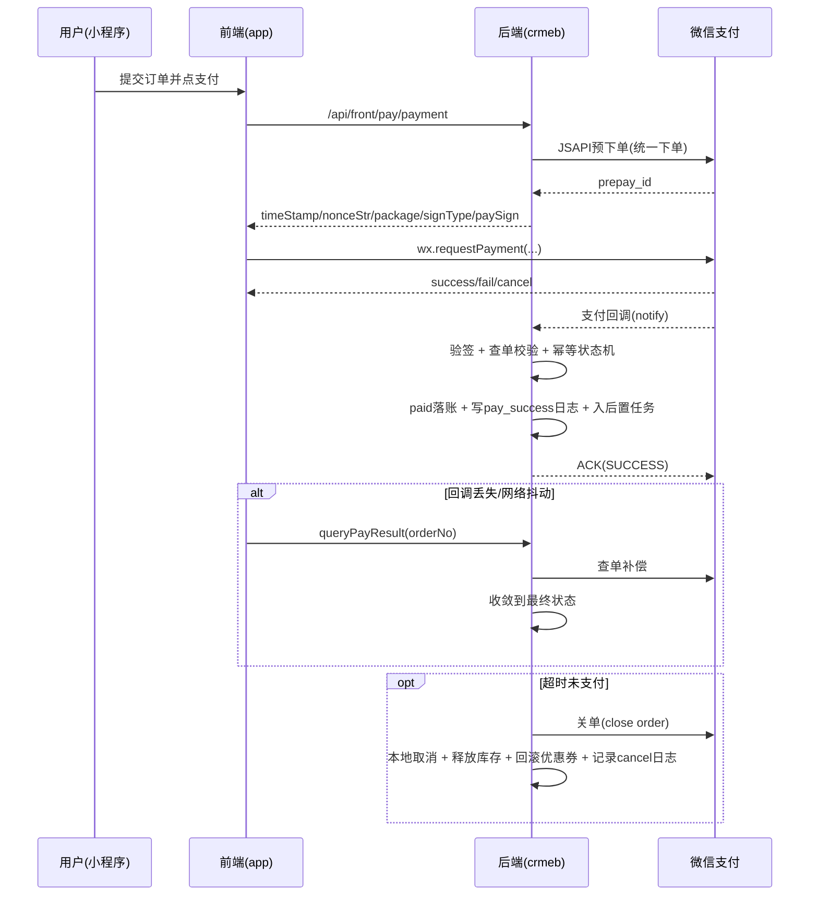
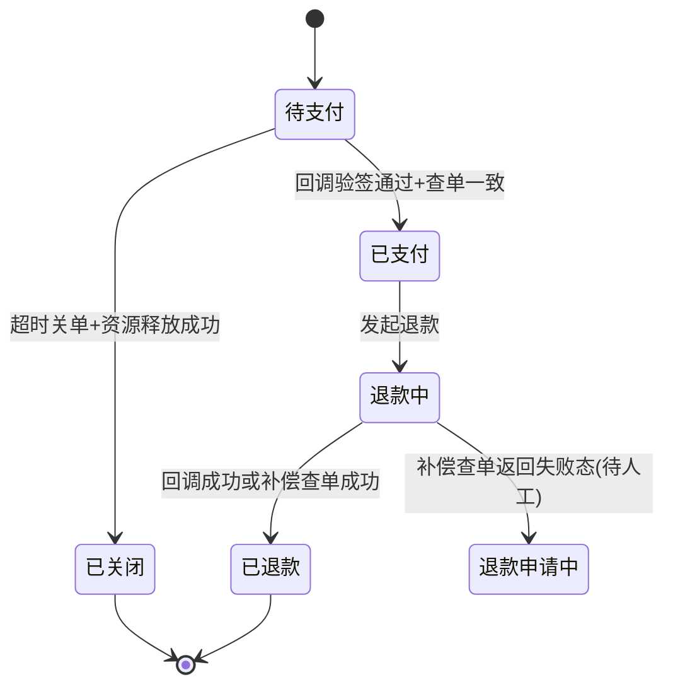

# 支付系统（微信JSAPI）时序图 + 状态机 + 异常补偿清单

- 日期：2026-02-18
- 范围：`crmeb_java/crmeb` 当前支付主链路（小程序 JSAPI）
- 目标：把“回调/查单一致性、幂等、超时关单、退款补偿、对账工单化”落成可验收资产

## 1. API verification log（官方核验）

- 触发范围：微信小程序支付（`wx.requestPayment` + 微信支付 v3）
- 校验日期：2026-02-18
- 官方文档：
  - 小程序拉起支付：<https://developers.weixin.qq.com/miniprogram/dev/api/payment/wx.requestPayment.html>
  - 服务商JSAPI下单：<https://pay.wechatpay.cn/doc/v3/partner/4012738519>
  - 支付回调通知：<https://pay.wechatpay.cn/doc/v3/partner/4012085146>
  - 查单：<https://pay.wechatpay.cn/doc/v3/partner/4012739008>
  - 关单：<https://pay.wechatpay.cn/doc/v3/partner/4012739019>
- 关键约束：
  - 前端只负责 `wx.requestPayment`，签名参数由后端生成。
  - 回调必须验签，并且不能只依赖回调，需要查单补偿。
  - 超时单应主动关单，避免“本地取消后通道侧仍可支付”。

## 2. JSAPI标准时序（当前项目目标形态）



## 3. 状态机（单向流转）



## 4. 异常补偿清单（18项）

| 检查ID | 类别 | 检查点 | 严重级别 |
|---|---|---|---|
| P01 | 回调/查单一致性 | 已支付但缺 `pay_success` 日志 | BLOCK |
| P02 | 回调/查单一致性 | 已支付但缺微信流水 | BLOCK |
| P03 | 回调/查单一致性 | 微信 `SUCCESS` 但本地未paid | BLOCK |
| P04 | 回调/查单一致性 | 已支付订单微信 `trade_state` 异常 | WARN |
| P05 | 幂等 | `pay_success` 重复日志 | BLOCK |
| P06 | 幂等 | `refund_price` 成功日志重复 | BLOCK |
| P07 | 幂等 | 同一 `out_trade_no` 多笔已支付订单 | BLOCK |
| P08 | 幂等 | 同一 `transaction_id` 多次出现 | BLOCK |
| P09 | 超时取消 | 超时未支付订单未取消 | BLOCK |
| P10 | 超时取消 | 自动取消缺失 `cancel` 日志 | BLOCK |
| P11 | 超时取消 | 自动取消后优惠券未回滚可用 | BLOCK |
| P12 | 超时取消 | 本地已取消但微信侧 `SUCCESS` | BLOCK |
| P13 | 退款补偿 | `refund_status=2` 但缺成功退款日志 | BLOCK |
| P14 | 退款补偿 | 有退款成功日志但状态未收敛为2 | BLOCK |
| P15 | 退款补偿 | `refund_status=3` 超时未收敛 | BLOCK |
| P16 | 退款补偿 | `refund_status=1` 长时间未推进 | WARN |
| P17 | 对账工单化 | 对账未消差但未生成工单 | BLOCK |
| P18 | 对账工单化 | 工单存在P1或SLA违约 | BLOCK |

## 5. 已实现 / 缺口（对照代码）

### 已实现

1. 前端支付参数由后端签名返回，前端走 `wx.requestPayment`
   - `crmeb_java/crmeb/crmeb-service/src/main/java/com/zbkj/service/service/impl/OrderPayServiceImpl.java`
2. 回调验签 + 查单一致性校验
   - `crmeb_java/crmeb/crmeb-service/src/main/java/com/zbkj/service/service/impl/CallbackServiceImpl.java`
3. 退款状态机 + 退款中超时补偿
   - `crmeb_java/crmeb/crmeb-service/src/main/java/com/zbkj/service/service/impl/OrderTaskServiceImpl.java`
4. 自动取消时释放优惠券、回滚库存、写取消日志
   - `crmeb_java/crmeb/crmeb-service/src/main/java/com/zbkj/service/service/impl/StoreOrderTaskServiceImpl.java`
5. 对账差异工单化
   - `crmeb_java/crmeb/shell/payment_reconcile_ticketize.sh`
6. 本轮新增：超时取消前先调用微信关单（v2/v3）
   - `crmeb_java/crmeb/crmeb-service/src/main/java/com/zbkj/service/service/WechatNewService.java`
   - `crmeb_java/crmeb/crmeb-service/src/main/java/com/zbkj/service/service/impl/WechatNewServiceImpl.java`
   - `crmeb_java/crmeb/crmeb-service/src/main/java/com/zbkj/service/service/impl/StoreOrderTaskServiceImpl.java`

### 缺口（下一步）

1. 缺“关单结果审计表/日志索引”，排查关单失败依赖应用日志。
2. 支付主键约束仍是“脚本巡检型”，未在核心表强制唯一约束（`out_trade_no`、`transaction_id`）。
3. 缺“支付状态读模型缓存（Redis）”，高频查询仍以MySQL为主。

## 6. 新增验收资产（本轮）

1. SQL基线：
   - `crmeb_java/crmeb/sql/payment_exception_acceptance_v1.sql`
2. 一键验收脚本：
   - `crmeb_java/crmeb/shell/payment_exception_acceptance.sh`
3. 值守接入：
   - `crmeb_java/crmeb/shell/payment_ops_status.sh`（refresh时自动执行并纳入判定）
   - `crmeb_java/crmeb/shell/payment_preflight_check.sh`（纳管脚本完整性）

## 7. 运行命令

```bash
cd /root/crmeb-java/crmeb_java/crmeb

# 全量验收（建议连Docker MySQL）
DB_PORT=33306 MYSQL_DEFAULTS_FILE=/root/.my.cnf \
./shell/payment_exception_acceptance.sh --date 2026-02-18

# 指定订单验收
DB_PORT=33306 MYSQL_DEFAULTS_FILE=/root/.my.cnf \
./shell/payment_exception_acceptance.sh \
  --date 2026-02-18 \
  --order-no 4200003006202602174039197150

# 值守总览（会自动执行异常验收）
DB_PORT=33306 MYSQL_DEFAULTS_FILE=/root/.my.cnf \
./shell/payment_ops_status.sh --date 2026-02-18 --refresh
```

